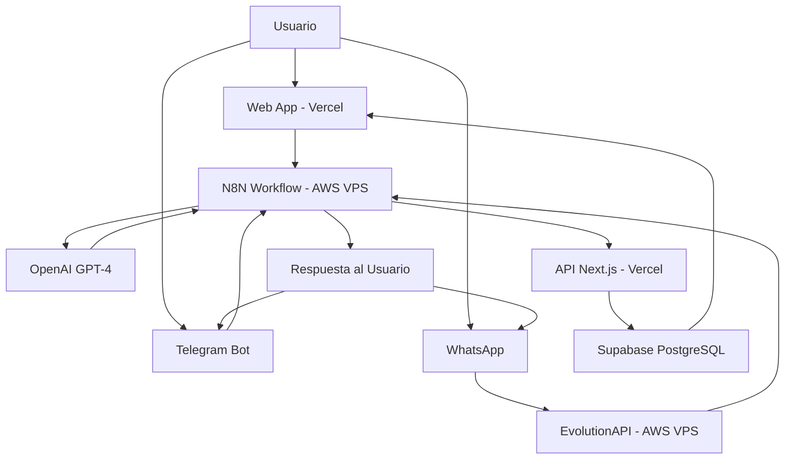
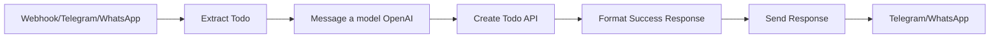

# 📋 Todo Automation Challenge - Documentación Completa

## 🌟 Descripción General

**Todo Automation Challenge** es una aplicación de gestión de tareas que integra múltiples canales de comunicación (Web, Telegram, WhatsApp) con inteligencia artificial para crear y gestionar tareas de forma automatizada.

### ✨ Características Principales

- 🤖 **IA Integrada**: OpenAI mejora automáticamente los títulos de las tareas
- 📱 **Multi-canal**: Web App, Telegram y WhatsApp
- 🔄 **Automatización**: N8N workflow para procesamiento inteligente
- 💾 **Base de datos**: Supabase para almacenamiento confiable
- 🎨 **UI Moderna**: Next.js con Tailwind CSS

---

## 🏗️ Arquitectura del Sistema



### 🔧 Stack Tecnológico

| Componente | Tecnología | Propósito |
|------------|------------|-----------|
| **Frontend** | Next.js 15 + React + TypeScript | Interfaz web moderna y responsiva |
| **UI/UX** | Tailwind CSS + Headless UI | Diseño consistente y profesional |
| **Base de Datos** | Supabase (PostgreSQL) | Almacenamiento de tareas y usuarios |
| **IA** | OpenAI GPT-4 Mini | Mejora automática de títulos |
| **Automatización** | N8N Self-hosted (AWS VPS) | Workflow de procesamiento |
| **Telegram Bot** | Telegram Bot API | Integración con Telegram |
| **WhatsApp** | EvolutionAPI (AWS VPS - EasyPanel) | Integración con WhatsApp |
| **Deployment** | Vercel | Hosting y CI/CD |
| **Infrastructure** | AWS VPS | Hosting para N8N y EvolutionAPI |

---

## 🗄️ Base de Datos

### Tabla: `todos`

```sql
CREATE TABLE todos (
  id SERIAL PRIMARY KEY,
  title VARCHAR(255) NOT NULL,
  completed BOOLEAN DEFAULT FALSE,
  user_email VARCHAR(255) NOT NULL,
  created_at TIMESTAMP DEFAULT NOW(),
  updated_at TIMESTAMP DEFAULT NOW()
);
```

| Campo | Tipo | Descripción |
|-------|------|-------------|
| `id` | SERIAL | Identificador único autoincremental |
| `title` | VARCHAR(255) | Título de la tarea |
| `completed` | BOOLEAN | Estado de completado (false por defecto) |
| `user_email` | VARCHAR(255) | Email del usuario propietario |
| `created_at` | TIMESTAMP | Fecha de creación |
| `updated_at` | TIMESTAMP | Fecha de última modificación |

---

## 🔌 API Endpoints

### Base URL: `https://todo-automation-challenge.vercel.app/api`

### 1. **POST** `/n8n/add-todo`
**Crear nueva tarea desde N8N**

```json
// Request
{
  "title": "Lavar el carro",
  "user_email": "usuario@ejemplo.com",
  "enhance": true
}

// Response
{
  "success": true,
  "todo": {
    "id": 123,
    "title": "Lavar el carro",
    "completed": false,
    "user_email": "usuario@ejemplo.com",
    "created_at": "2025-01-XX...",
    "updated_at": "2025-01-XX..."
  },
  "message": "Todo \"Lavar el carro\" created successfully",
  "n8n_response": {
    "status": "created",
    "id": 123,
    "title": "Lavar el carro",
    "user": "usuario@ejemplo.com"
  }
}
```

### 2. **POST** `/enhance-title`
**Mejorar título con IA**

```json
// Request
{
  "title": "lavar carro"
}

// Response
{
  "original_title": "lavar carro",
  "enhanced_title": "Lavar el carro",
  "improvements": ["Capitalización", "Artículo agregado"]
}
```

### 3. **GET/POST/PUT/DELETE** `/todos`
**CRUD operaciones para tareas (uso interno del frontend)**

---

## 🤖 N8N Workflow

### Flujo Principal



### Nodos del Workflow

#### 1. **Triggers (Entradas)**
- **Webhook**: Recibe tareas desde la aplicación web
- **Telegram Trigger**: Recibe mensajes de Telegram
- **EvolutionApi**: Recibe mensajes de WhatsApp

#### 2. **Extract Todo** (Code Node)
```javascript
// Detecta origen y extrae texto + email
// Normaliza texto (quita #to-do si existe)
// Retorna: { title, user_email, enhance, chat_id?, whatsapp_jid? }
```

#### 3. **Message a model** (OpenAI Node)
- **Modelo**: GPT-4O-MINI
- **Prompt**: Sistema que mejora títulos de tareas
- **Input**: Texto de la tarea
- **Output**: Título mejorado + mensaje de confirmación

#### 4. **Create Todo** (HTTP Request Node)
- **URL**: `https://todo-automation-challenge.vercel.app/api/n8n/add-todo`
- **Método**: POST
- **Body**: título, email, enhance flag

#### 5. **Format Success Response** (Code Node)
```javascript
// Formatea respuesta para diferentes canales
// Incluye chat_id para Telegram, whatsapp_jid para WhatsApp
```

#### 6. **Send Responses** (Output Nodes)
- **Send a text message1**: Telegram Bot API
- **Enviar texto**: EvolutionAPI para WhatsApp
- **Success Response**: Webhook response para aplicación web

---

## 🚀 Instalación y Configuración

### Prerrequisitos

- Node.js 18+
- AWS VPS para N8N y EvolutionAPI
- Supabase account
- OpenAI API key
- Telegram Bot Token
- EvolutionAPI configurado

### 1. **Configurar Aplicación Web**

```bash
# Clonar repositorio
git clone <repository-url>
cd todo-automation-challenge

# Instalar dependencias
npm install

# Configurar variables de entorno
cp .env.local.example .env.local
```

**Variables de entorno (.env.local):**
```env
NEXT_PUBLIC_SUPABASE_URL=your_supabase_url
NEXT_PUBLIC_SUPABASE_ANON_KEY=your_supabase_anon_key
NEXTAUTH_URL=http://localhost:3000
```

```bash
# Ejecutar en desarrollo
npm run dev

# Build para producción
npm run build
npm start
```

### 2. **Configurar Supabase**

```sql
-- Crear tabla todos
CREATE TABLE todos (
  id SERIAL PRIMARY KEY,
  title VARCHAR(255) NOT NULL,
  completed BOOLEAN DEFAULT FALSE,
  user_email VARCHAR(255) NOT NULL,
  created_at TIMESTAMP DEFAULT NOW(),
  updated_at TIMESTAMP DEFAULT NOW()
);

-- Habilitar Row Level Security
ALTER TABLE todos ENABLE ROW LEVEL SECURITY;

-- Política de acceso (opcional)
CREATE POLICY "Users can view own todos" ON todos
  FOR SELECT USING (auth.jwt() ->> 'email' = user_email);
```

### 3. **Configurar N8N en AWS VPS**

#### Instalar N8N en VPS
```bash
# Conectar al VPS de AWS
ssh -i your-key.pem ubuntu@your-vps-ip

# Instalar Node.js y N8N
curl -fsSL https://deb.nodesource.com/setup_18.x | sudo -E bash -
sudo apt-get install -y nodejs
npm install -g n8n

# Configurar como servicio (opcional)
n8n start --host 0.0.0.0 --port 5678
```

#### Importar Workflow
1. Acceder a N8N (http://your-vps-ip:5678)
2. Ir a Workflows > Import from File
3. Seleccionar archivo `To-doF.json`

#### Configurar Credenciales
- **OpenAI API**: Agregar API key
- **Telegram API**: Bot token
- **EvolutionAPI**: URL y credenciales

#### Variables de Entorno N8N
```env
N8N_BASIC_AUTH_ACTIVE=true
N8N_BASIC_AUTH_USER=admin
N8N_BASIC_AUTH_PASSWORD=your_password
```

### 4. **Configurar Telegram Bot** (Opcional)

```bash
# Crear bot con @BotFather
/newbot
# Seguir instrucciones
# Copiar token generado

# Configurar webhook (si es necesario)
curl -X POST "https://api.telegram.org/bot<TOKEN>/setWebhook" \
  -H "Content-Type: application/json" \
  -d '{"url": "https://your-n8n.com/webhook/telegram"}'
```

### 5. **Configurar WhatsApp en AWS VPS**

#### EvolutionAPI Setup con EasyPanel
```bash
# EvolutionAPI se configuró usando EasyPanel en AWS VPS
# EasyPanel facilita el despliegue y gestión de contenedores

# La configuración se realiza a través de la interfaz web de EasyPanel:
# 1. Acceder a EasyPanel dashboard en el VPS
# 2. Crear nueva aplicación EvolutionAPI
# 3. Configurar variables de entorno desde la interfaz
# 4. Deploy automático y gestión simplificada
```

#### Configurar Instancia
```json
{
  "instanceName": "To-do",
  "webhook": {
    "url": "https://your-n8n.com/webhook/messages-upsert",
    "events": ["messages.upsert"]
  }
}
```

**Configuración con EasyPanel:**
EasyPanel proporciona una interfaz web intuitiva para gestionar EvolutionAPI en el VPS de AWS, facilitando el despliegue, configuración de variables de entorno, logs centralizados y monitoreo integrado.

---

## 📱 Guía de Uso

### 💻 Aplicación Web

1. **Acceder**: Ir a `https://todo-automation-challenge.vercel.app`
2. **Configurar Email**: Ingresar email válido cuando se solicite
3. **Crear Tareas**: Escribir tarea en el campo de texto y hacer clic en "Crear con IA"
4. **Gestionar**: Marcar como completadas, editar o eliminar tareas

### 📱 Telegram

1. **Buscar Bot**: `@poisonedDogbot`
2. **Iniciar**: `/start`
3. **Crear Tarea**: Escribir directamente la tarea
   ```
   Ejemplo: "lavar el carro"
   Bot: "✅ To-do creada: Lavar el carro"
   ```

### 💬 WhatsApp

1. **Añadir Número**: +57 305 3584393 (número de pruebas)
2. **Enviar Tarea**: Escribir directamente la tarea
   ```
   Usuario: "lavar el carro"
   Bot: "✅ To-do creada: Lavar el carro"
   ```

**Nota**: El sistema detecta automáticamente el texto como tarea y la procesa con IA.

---

## 🔧 Mantenimiento y Monitoreo

### Logs y Debugging

#### N8N
- **Logs**: Ver ejecuciones en N8N interface
- **Debug**: Activar modo debug en cada nodo
- **Errores**: Revisar failed executions

#### Aplicación Web
```bash
# Logs en desarrollo
npm run dev

# Logs en producción (Vercel)
vercel logs
```

#### Supabase
- **Dashboard**: Monitor queries y performance
- **Logs**: Revisar logs de API en dashboard

### Backup y Recuperación

#### Base de Datos
```bash
# Backup manual desde Supabase Dashboard
# O usando pg_dump si tienes acceso directo
```

#### N8N Workflows
```bash
# Exportar workflow desde N8N interface
# Guardar archivo JSON en repositorio
```

### Escalabilidad

#### Optimizaciones
- **Índices**: Agregar índices en columnas frecuentemente consultadas
- **Caching**: Implementar Redis para sesiones
- **CDN**: Usar Vercel Edge para assets estáticos

---

## 🚨 Solución de Problemas

### Problemas Comunes

#### 1. **N8N no recibe webhooks**
```bash
# Verificar URL webhook
curl -X POST "https://your-n8n.com/webhook/todo-webhook" \
  -H "Content-Type: application/json" \
  -d '{"test": "data"}'

# Revisar firewall y DNS
```

#### 2. **OpenAI API Errors**
- **Rate Limit**: Verificar límites de API
- **Invalid Key**: Revisar API key en N8N credentials
- **Model Access**: Confirmar acceso a modelo GPT-4O-MINI

#### 3. **Supabase Connection Issues**
- **URL/Key**: Verificar credenciales en .env.local
- **RLS**: Revisar políticas de Row Level Security
- **Network**: Verificar conectividad

#### 4. **Telegram Bot No Responde**
- **Token**: Verificar bot token
- **Webhook**: Confirmar configuración de webhook
- **Permissions**: Revisar permisos del bot

#### 5. **WhatsApp Integration Problems**
- **EvolutionAPI**: Verificar estado del servicio
- **Instance**: Confirmar configuración de instancia
- **QR Code**: Rescanear código QR si es necesario

### Logs de Error Típicos

```javascript
// Error de autenticación Supabase
"Invalid API key"
→ Solución: Verificar NEXT_PUBLIC_SUPABASE_ANON_KEY

// Error N8N workflow
"Node execution failed"
→ Solución: Revisar credenciales y datos de entrada

// Error OpenAI
"Rate limit exceeded"  
→ Solución: Esperar o actualizar plan OpenAI
```

---

## 📈 Métricas y Analytics

### KPIs Sugeridos
- **Tareas creadas por día**
- **Tasa de completado**
- **Uso por canal (Web/Telegram/WhatsApp)**
- **Tiempo de respuesta de IA**
- **Errores por hora**

### Implementación
```sql
-- Query para métricas básicas
SELECT 
  DATE(created_at) as date,
  COUNT(*) as tasks_created,
  COUNT(CASE WHEN completed THEN 1 END) as tasks_completed,
  ROUND(COUNT(CASE WHEN completed THEN 1 END) * 100.0 / COUNT(*), 2) as completion_rate
FROM todos 
WHERE created_at >= NOW() - INTERVAL '30 days'
GROUP BY DATE(created_at)
ORDER BY date DESC;
```

---

## 🔄 Versionado y Updates

### Versión Actual: v1.0.0

### Próximas Características
- [ ] Categorización automática de tareas
- [ ] Recordatorios programados
- [ ] Colaboración entre usuarios
- [ ] Integración con Google Calendar
- [ ] Dashboard de analytics

### Proceso de Update
1. **Backup** de base de datos
2. **Test** en ambiente de desarrollo
3. **Deploy** gradual
4. **Monitor** post-deploy

---

## 👥 Contribución

### Estructura del Proyecto
```
todo-automation-challenge/
├── app/                    # Next.js App Router
│   ├── api/               # API Routes
│   ├── globals.css        # Estilos globales
│   └── page.tsx          # Página principal
├── lib/                   # Utilidades
│   └── supabase.ts       # Cliente Supabase
├── public/               # Assets estáticos
├── To-doF.json          # N8N Workflow
└── DOCUMENTACION.md     # Este archivo
```

### Guidelines
- **Código**: Seguir estándares TypeScript/React
- **Commits**: Usar conventional commits
- **Testing**: Escribir tests para nuevas funciones
- **Documentation**: Actualizar documentación

---

## 📞 Soporte

### Contacto
- **Email**: alexis26-93@Live.com
- **GitHub**: https://github.com/AlexisPalacioDev/todo-automation-challenge.git
- **LinkedIn**: https://www.linkedin.com/in/poisoneddog/
- **Telegram Bot**: @poisonedDogbot
- **WhatsApp Pruebas**: +57 305 3584393
- **Web App**: https://todo-automation-challenge.vercel.app

### FAQ

**P: ¿Puedo usar otros modelos de IA?**
R: Sí, puedes cambiar el modelo en el nodo OpenAI de N8N.

**P: ¿Soporta otros idiomas?**
R: Sí, OpenAI detecta automáticamente el idioma del usuario.

**P: ¿Es escalable para muchos usuarios?**
R: Sí, usando Supabase y Vercel puede manejar miles de usuarios.

**P: ¿Puedo self-hostear todo?**
R: Sí, todas las tecnologías usadas tienen opciones self-hosted.

---

## 📄 Licencia

MIT License - Ver archivo LICENSE para más detalles.

---

*Documentación actualizada: Enero 2025*
*Versión del proyecto: 1.0.0*