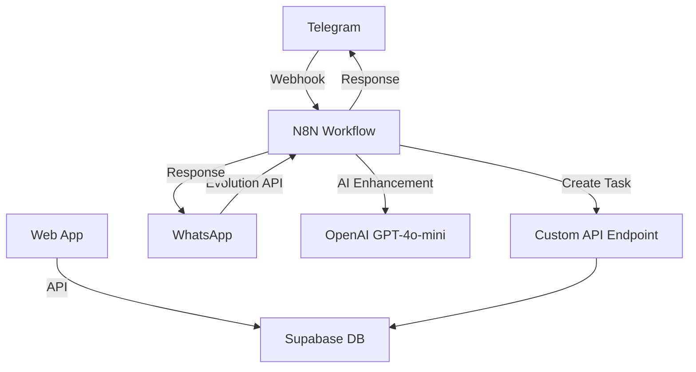

# 🔨 TaskForge AI - Forge Smarter Tasks with AI

> Transform your productivity with AI-enhanced task management and multi-platform automation

## 🚀 Live Demo
- **App**: [https://todo-automation-challenge.vercel.app](https://todo-automation-challenge.vercel.app)
- **N8N Workflow**: `https://n8n-n8n.lehnwx.easypanel.host` (credentials provided separately)

## ✨ Features

### 🤖 AI-Powered Task Enhancement  
- **Intelligent Title Optimization**: AI automatically improves task clarity and actionability
- **Multi-language Support**: Works in English, Spanish, and other languages
- **Smart Categorization**: AI suggests priority levels and categories

### 📱 Multi-Platform Integration
- **Web Interface**: Beautiful neumorphic design with dark/light mode
- **Telegram Integration**: Create tasks via Telegram messages with `#to-do`
- **WhatsApp Support**: Full WhatsApp integration via Evolution API
- **Cross-platform Sync**: Tasks sync across all platforms instantly

### 🔄 Advanced Automation
- **N8N Workflows**: Visual automation workflows for task processing
- **Real-time Processing**: Immediate AI enhancement and database updates
- **Smart Filtering**: Only processes messages with `#to-do` trigger
- **Error Handling**: Robust error management and retry mechanisms

### 🎨 Modern UI/UX
- **Neumorphic Design**: Beautiful soft shadows and depth effects
- **Dark/Light Mode**: Automatic theme detection with manual toggle
- **Responsive Design**: Perfect on mobile, tablet, and desktop
- **Swipe Gestures**: Swipe left to delete tasks on mobile
- **Smooth Animations**: Delightful micro-interactions

## 🏗️ Architecture



### Tech Stack
- **Frontend**: Next.js 14, TypeScript, Tailwind CSS
- **Database**: Supabase (PostgreSQL)
- **Automation**: N8N workflows
- **AI**: OpenAI GPT-4o-mini
- **Messaging**: Telegram Bot API, Evolution API (WhatsApp)
- **Hosting**: Vercel

## 🚀 Quick Start

### Prerequisites
- Node.js 18+
- npm/yarn/pnpm
- Supabase project
- N8N instance (optional for full features)

### Installation
```bash
# Clone the repository
git clone https://github.com/yourusername/todo-automation-challenge
cd todo-automation-challenge

# Install dependencies
npm install

# Copy environment variables
cp .env.example .env.local

# Run the development server
npm run dev
```

### Environment Variables
```env
# Supabase
NEXT_PUBLIC_SUPABASE_URL=your_supabase_url
NEXT_PUBLIC_SUPABASE_ANON_KEY=your_supabase_anon_key
SUPABASE_SERVICE_ROLE_KEY=your_service_role_key

# OpenAI (for N8N workflow)
OPENAI_API_KEY=your_openai_api_key

# N8N Webhook URLs
N8N_WEBHOOK_URL=your_n8n_webhook_url
N8N_TEST_WEBHOOK_URL=your_n8n_test_webhook_url
```

### Database Setup
```sql
-- Create todos table
CREATE TABLE todos (
  id BIGINT GENERATED BY DEFAULT AS IDENTITY PRIMARY KEY,
  title TEXT NOT NULL,
  completed BOOLEAN DEFAULT FALSE,
  user_email TEXT NOT NULL,
  created_at TIMESTAMP WITH TIME ZONE DEFAULT NOW(),
  updated_at TIMESTAMP WITH TIME ZONE DEFAULT NOW()
);

-- Enable RLS
ALTER TABLE todos ENABLE ROW LEVEL SECURITY;

-- Create RLS policies
CREATE POLICY "Users can view own todos" ON todos
  FOR SELECT USING (auth.jwt() ->> 'email' = user_email OR user_email IS NOT NULL);

CREATE POLICY "Users can insert own todos" ON todos
  FOR INSERT WITH CHECK (true);

CREATE POLICY "Users can update own todos" ON todos
  FOR UPDATE USING (auth.jwt() ->> 'email' = user_email OR user_email IS NOT NULL);

CREATE POLICY "Users can delete own todos" ON todos
  FOR DELETE USING (auth.jwt() ->> 'email' = user_email OR user_email IS NOT NULL);
```

## 🤖 N8N Workflow Configuration

The "TaskForge" workflow handles:

1. **Multi-source Input**: Web, Telegram, WhatsApp
2. **Message Parsing**: Extract todo text and user info
3. **AI Enhancement**: Improve titles with GPT-4o-mini
4. **Database Storage**: Save to Supabase via API
5. **Response Delivery**: Send confirmation to appropriate channel

### Workflow Nodes:
- **Webhook Trigger**: Web app input
- **Telegram Trigger**: Telegram messages
- **Evolution API Webhook**: WhatsApp messages
- **Extract Todo**: Parse and normalize input
- **OpenAI Node**: AI enhancement
- **HTTP Request**: Create todo via API
- **Response Formatting**: Prepare success messages
- **Multi-channel Response**: Telegram/WhatsApp replies

## 📱 Usage Examples

### Web Interface
1. Enter task: "buy milk"
2. AI enhances to: "Buy organic milk from grocery store"  
3. Task saved with improved clarity

### Telegram
```
Send: "#to-do call dentist"
Bot replies: "✅ To-do created: Schedule dentist appointment for checkup"
```

### WhatsApp  
```
Send: "#to-do workout"
Bot replies: "✅ To-do creada: Complete 30-minute workout routine"
```

## 🎨 Design System

### Colors
- **Primary**: `#667eea` (Soft Blue)
- **Success**: `#10b981` (Green)
- **Warning**: `#f59e0b` (Amber)
- **Error**: `#ef4444` (Red)

### Typography
- **Display**: SF Pro Display (Apple devices), Segoe UI (Windows)
- **Body**: SF Pro Text, Segoe UI, system fonts
- **Code**: Geist Mono, monospace

### Components
- **Neumorphic Cards**: Soft shadows with depth
- **Gradient Buttons**: Subtle gradients for interactions
- **Smooth Animations**: 200ms ease transitions
- **Responsive Layout**: Mobile-first design

## 🔧 API Endpoints

### POST `/api/n8n/add-todo`
Create a new task via N8N integration
```json
{
  "title": "Task title",
  "user_email": "user@example.com",
  "enhance": true
}
```

**Response:**
```json
{
  "success": true,
  "data": {
    "id": 1,
    "title": "Enhanced task title",
    "completed": false,
    "user_email": "user@example.com",
    "created_at": "2025-01-01T00:00:00Z"
  },
  "message": "Task created successfully"
}
```

## 🚀 Deployment

### Vercel (Recommended)
```bash
# Install Vercel CLI
npm i -g vercel

# Deploy
vercel

# Set environment variables in Vercel dashboard
```

### Manual Deployment
1. Build the project: `npm run build`
2. Upload `dist` folder to your hosting provider
3. Configure environment variables
4. Set up database and N8N webhooks

## 🤝 Contributing

1. Fork the repository
2. Create a feature branch: `git checkout -b feature/amazing-feature`
3. Commit changes: `git commit -m 'Add amazing feature'`
4. Push to branch: `git push origin feature/amazing-feature`
5. Open a Pull Request

## 📝 License

This project is licensed under the MIT License - see the [LICENSE](LICENSE) file for details.

## 🙏 Acknowledgments

- **OpenAI** for GPT-4o-mini API
- **Supabase** for backend infrastructure
- **N8N** for workflow automation
- **Vercel** for hosting and deployment
- **Next.js** team for the amazing framework

## 🐛 Known Issues

- [ ] WhatsApp media messages not yet supported
- [ ] Task categories UI in development
- [ ] Bulk operations planned for v2

## 🗺️ Roadmap

- [ ] **V1.1**: Task categories and priority levels
- [ ] **V1.2**: Team collaboration features  
- [ ] **V1.3**: Calendar integration
- [ ] **V2.0**: Advanced AI features and analytics

---

<div align="center">

**Made with ❤️ for the AI Automation Developer Challenge**

[Report Bug](https://github.com/yourusername/todo-automation-challenge/issues) · 
[Request Feature](https://github.com/yourusername/todo-automation-challenge/issues) · 
[Documentation](https://github.com/yourusername/todo-automation-challenge/wiki)

</div>
